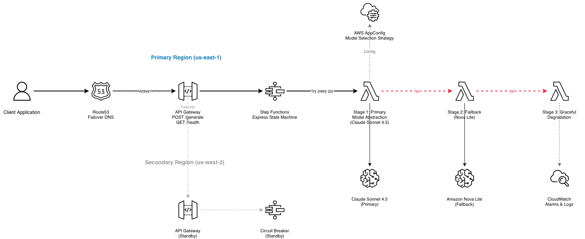

# Financial Services AI Assistant

A production-grade customer service AI assistant for financial services, built with **AWS serverless** architecture, **Amazon Bedrock** for inference, and a **circuit breaker pattern** for high availability.

## Architecture



> Architecture source: [architecture.drawio](architecture.drawio) — open with [draw.io](https://app.diagrams.net/)

## Features

- **Model Abstraction Layer** — Lambda function with AppConfig-driven model selection
- **Dynamic Configuration** — Switch models without redeployment via AWS AppConfig
- **Circuit Breaker** — Step Functions with retry → fallback → graceful degradation
- **Cross-Region HA** — Deploy to multiple regions with Route53 failover
- **API Gateway** — RESTful endpoint with throttling and health checks
- **Financial Compliance** — System prompts enforce regulatory guidelines
- **CloudWatch Alarms** — Monitor errors and API 5xx rates

## Prerequisites

- AWS CLI configured with appropriate credentials
- Bedrock model access enabled (Claude Sonnet 4.5, Nova Lite)
- IAM permissions for CloudFormation, Lambda, Step Functions, API Gateway, AppConfig

## Quick Start

### 1. Deploy to primary region

```bash
./scripts/deploy.sh us-east-1 prod
```

### 2. Test the API

```bash
./scripts/test_api.sh
```

### 3. (Optional) Deploy to secondary region for HA

```bash
./scripts/deploy.sh us-west-2 prod
```

### 4. Evaluate and update model selection

```bash
python evaluate_models.py
# Uploads new strategy to AppConfig
```

## API Usage

### POST /generate

```bash
curl -X POST https://<api-id>.execute-api.us-east-1.amazonaws.com/prod/generate \
  -H "Content-Type: application/json" \
  -d '{
    "prompt": "What is a 401(k) retirement plan?",
    "use_case": "general",
    "session_id": "user-123"
  }'
```

**Use cases**: `general`, `product_question`, `account_inquiry`, `compliance`, `investment`

### GET /health

```bash
curl https://<api-id>.execute-api.us-east-1.amazonaws.com/prod/health
```

## Project Structure

```
financial-ai-assistant/
├── cloudformation/
│   └── template.yaml          # Full infrastructure (Lambda, SFN, APIGW, AppConfig)
├── lambdas/
│   ├── model_abstraction/     # Primary model handler + AppConfig
│   ├── fallback_model/        # Fallback with conservative settings
│   └── graceful_degradation/  # Pre-defined responses
├── step_functions/
│   └── circuit_breaker.asl.json  # State machine definition
├── scripts/
│   ├── deploy.sh              # Deploy CloudFormation stack
│   ├── teardown.sh            # Delete stack and resources
│   └── test_api.sh            # Test deployed API endpoints
├── config/                    # Generated configs (gitignored)
├── evaluate_models.py         # Model evaluation and strategy generation
├── .env.example
└── README.md
```

## Circuit Breaker Flow

1. **Primary Model** (Claude Sonnet 4.5) — Full capability, AppConfig-driven selection
   - Retries 2x with exponential backoff on transient failures
   - 30s timeout
2. **Fallback Model** (Nova Lite) — Simpler model, conservative parameters
   - Retries 2x
   - 20s timeout, reduced token limit
3. **Graceful Degradation** — Pre-defined helpful responses
   - Always succeeds (no AI dependency)
   - Directs users to human support channels

## Cross-Region Deployment

Deploy the same CloudFormation template to multiple regions, then configure Route53 failover:

```bash
# Primary
./scripts/deploy.sh us-east-1 prod

# Secondary
./scripts/deploy.sh us-west-2 prod

# Configure Route53 health check + failover (see docs below)
```

### Route53 Failover Setup

1. Create a health check pointing to `GET /health` on the primary region
2. Create DNS A/AAAA records with failover routing policy
3. Primary → us-east-1 API Gateway (with health check)
4. Secondary → us-west-2 API Gateway

## Cleanup

```bash
./scripts/teardown.sh us-east-1 prod
./scripts/teardown.sh us-west-2 prod  # if deployed
```

## License

MIT
